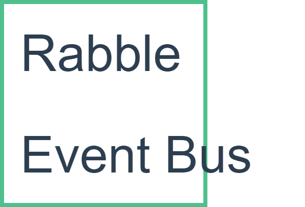

# Rabble EventBus



A library make you publish and subscribe event easier in ditributed microservice,serverless or any architecture.

## Installing EventBus

``` cmd

Install-Package Rabble.EventBus.RabbitMQ

```

## Usage

### ASP.NET Core

``` csharp

public void Configure(IServiceCollection services)
{
     services.AddRabbitMQEventBus(opt =>
            {

                opt.Host = "ha-proxy-host-for connect RabbitMQ";
                opt.QueueName = "Current Application Name";
            });
}

public void Configure(IApplicationBuilder app,IEventBus ebs)
{
    ebs.Subscribe<MyIntegrationEvent,MyIntegrationEventHandler>();
}

```

### ASP.NET or .NET Framework

``` csharp

EventbusFactory.Initialize(opt=>{
		opt.Host = "ha-proxy-host-for connect RabbitMQ";
        opt.QueueName = "Current Application Name";
});

EventbusFactory.GetRequiredService<IEventBus>();

```